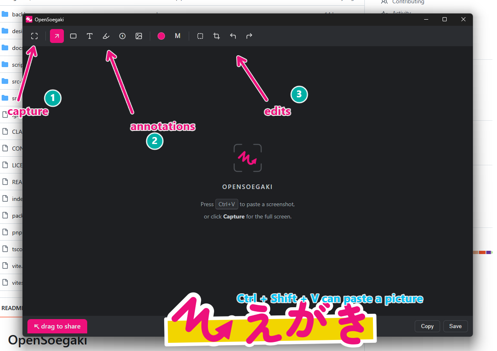

# OpenSoegaki

**Capture. Annotate. Share.** — A fast, lightweight, open-source screenshot annotation tool.

OpenSoegaki is a spiritual successor to the discontinued Skitch for Windows. It lives in
your system tray; shoot a screenshot with the OS tool (Win+Shift+S) and paste it in with
Ctrl+V, mark it up with arrows, highlights, numbered steps and more, then hand the result
to any other app with a single drag — all in seconds.



> **Status:** 🚧 Early development. Windows 11 first; macOS support is planned.

## Features

- **Paste to annotate** — paste a screenshot from the clipboard with `Ctrl+V` (shoot it
  first with the OS tool, e.g. `Win+Shift+S`); a **Capture** toolbar button grabs the
  full screen too
- **Annotate** — outlined **arrows**, **rectangles**, in-canvas **text**, a freehand
  **highlighter**, and **numbered step badges**
- **Insert images** — add a screenshot, logo, or diagram as its own annotation object,
  via the toolbar button, `Ctrl+Shift+V`, or drag-and-drop
- **Color & size presets** — an 8-color palette and S/M/L size presets apply to stroke
  width and font size
- **Select, move, and delete** — click an annotation to select it, drag to reposition,
  `Delete`/`Backspace` to remove
- **Crop** — trim the image in-editor; `Enter` applies, `Esc` cancels
- **Undo / Redo** — annotations are objects, not pixels, until you export
- **Share** — drag the tab at the bottom of the window straight into Slack, a browser,
  an email draft, or any drop target; `Ctrl+C` copies the PNG to the clipboard, or
  `Ctrl+S` saves it to disk

## Download & install

Grab the latest bundle from [GitHub Releases](https://github.com/callas1900/opensoegaki/releases).

Bundles are currently **unsigned**:

- **Windows:** SmartScreen will warn about an unrecognized publisher. Click
  "More info" → "Run anyway" to proceed.
- **macOS:** Gatekeeper reports the app as *"damaged and can't be opened"*
  (right-click → Open does **not** bypass this dialog). Clear the quarantine flag
  once from a terminal, then launch normally:

  ```sh
  xattr -dr com.apple.quarantine /Applications/OpenSoegaki.app
  ```

  Note: the macOS build currently targets Apple Silicon (aarch64) only.

## Web version (iPhone)

An installable, iPhone-focused web build is available at
[https://callas1900.github.io/opensoegaki/](https://callas1900.github.io/opensoegaki/) —
no App Store, no install required, though it can be added to your Home Screen
(Share → Add to Home Screen) for a full-screen, offline-capable experience.

**Works on iPhone:** choosing a photo from your library, every annotation tool
(arrow, rectangle, text, highlighter, step badges, insert-image), crop,
undo/redo, pasting an image, Save via the Share sheet, best-effort Copy,
installing to the Home Screen, and offline use once installed.

**Doesn't work on iPhone:** full-screen OS capture (Safari has no API for it)
and native drag-out — both stay desktop-only; pasting a screenshot still
works the same way.

**Privacy:** the web build runs entirely on your device — images are never
uploaded anywhere. There is no server component, on the web or otherwise.

**Requirements:** iOS 16.4+ (for reliable canvas export and clipboard support
in Safari).

See [docs/WEB.md](docs/WEB.md) for the full design and an iOS manual
smoke-test checklist.

## Hotkeys

OpenSoegaki registers no global (system-wide) hotkeys; all shortcuts below are
in-app only, active while the OpenSoegaki window has focus.

| Action                                        | Windows/Linux             | macOS                   |
| --------------------------------------------- | ------------------------- | ----------------------- |
| Paste screenshot (replaces the background)    | `Ctrl+V`                  | `Cmd+V`                 |
| Insert clipboard image as an annotation       | `Ctrl+Shift+V`            | `Cmd+Shift+V`           |
| Copy result PNG to clipboard                  | `Ctrl+C`                  | `Cmd+C`                 |
| Save PNG                                      | `Ctrl+S`                  | `Cmd+S`                 |
| Undo / Redo                                   | `Ctrl+Z` / `Ctrl+Shift+Z` | `Cmd+Z` / `Cmd+Shift+Z` |
| Delete selected annotation                    | `Delete` / `Backspace`    | `Delete` / `Backspace`  |
| Cancel crop / clear selection / close popover | `Esc`                     | `Esc`                   |
| Apply pending crop                            | `Enter`                   | `Enter`                 |

On macOS, the first capture requires granting the **Screen Recording** permission
(System Settings → Privacy & Security → Screen Recording); macOS only applies a newly
granted permission after you **restart OpenSoegaki**.

## Why Tauri?

OpenSoegaki is built with [Tauri 2](https://tauri.app) (Rust core + TypeScript/Canvas UI):

- ~10 MB installer and low idle memory — right-sized for an always-resident tray utility
- Screen capture handled natively in Rust via [`xcap`](https://crates.io/crates/xcap)
- The same codebase targets Windows, macOS and Linux, keeping the door open for the
  planned macOS release

## Getting started (development)

Prerequisites:

- [Rust](https://rustup.rs/) (stable)
- [Node.js](https://nodejs.org/) 20+ and [pnpm](https://pnpm.io/) 9+
- Windows 11: WebView2 is preinstalled; nothing extra needed
- See the [Tauri prerequisites](https://tauri.app/start/prerequisites/) for other platforms

```sh
pnpm install
pnpm tauri dev
```

Build a release bundle:

```sh
pnpm tauri build
```

## Project layout

```
src/           TypeScript frontend — editor/ (annotation object model, canvas, rendering), ui/ (toolbar popovers), platform/ (desktop/web IO seam)
src-tauri/     Rust core (tray, screen capture, clipboard, drag-out)
pwa/           Web (iPhone PWA) shell — index.html, manifest, service worker, icons
docs/          Architecture and design documents
.claude/       AI-assisted development configuration (Claude Code agents)
```

See [docs/ARCHITECTURE.md](docs/ARCHITECTURE.md) for the design overview and
[CONTRIBUTING.md](CONTRIBUTING.md) if you'd like to help.

## Non-affiliation notice

OpenSoegaki is an independent open-source project. It is **not** affiliated with,
endorsed by, or connected to Evernote, Bending Spoons, or the Skitch product.
"Skitch" is a trademark of its respective owner; OpenSoegaki re-implements a similar
workflow with an original name, design, and codebase.

## License

[MIT](LICENSE)
